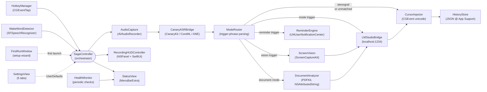

# Saga Architecture

> Last reviewed: 2026-05-05 — efter M0–M6 + M8 merge.
> Dette dokument afspejler den **faktiske** kode i `saga-app/Sources/` og erstatter en forældet version som beskrev det fjernede Hviske/Python sidecar.

## Overblik

Saga er en Swift 6 / SwiftUI menubar-only macOS-applikation (`LSUIElement = true`). Hele dictation-flowet kører lokalt: audio → CoreML ASR → cursor injection. Avancerede modes router transkriberet tekst gennem en valgfri lokal LM Studio-instans. **Intet forlader enheden over netværket andet end localhost.**

## Modul-diagram



## Kilder pr. ansvar

| Layer | Files | Ansvar |
|---|---|---|
| App entry | `Sources/SagaApp/SagaAppMain.swift` | `@main`, `NSApplicationDelegate`, app lifecycle |
| Orchestration | `Sources/SagaCore/App/SagaController.swift` | Central state machine: idle → recording → transcribing → routing → injecting |
| Hotkey | `Sources/SagaCore/Hotkey/HotkeyManager.swift` | `CGEventTap` på key-down/up, fem konfigurerbare hotkeys (rightOption, leftOption, rightCommand, rightControl, fn) |
| Audio | `Sources/SagaCore/Audio/AudioCapture.swift` | `AVAudioRecorder` til 16 kHz mono WAV i temp-fil, level-polling til HUD |
| ASR | `Sources/SagaCore/Bridge/CanaryASRBridge.swift` | Wraps `CanaryKit` (ekstern Swift package). Loader CoreML-modeller fra `Saga.app/Contents/Resources/mlpackage/` |
| Mode routing | `Sources/SagaCore/Modes/ModeRouter.swift` | Parser transcript for trigger-phrases; emitter `Mode` enum + payload. Stenograf-mode bypasser routing |
| LM bridge | `Sources/SagaCore/Bridge/LMStudioBridge.swift` | OpenAI-kompatibel HTTP-klient mod `localhost:1234`. Auto-discovery af 1234/1235/8080/5000/11434/8000 |
| Vision | `Sources/SagaCore/Vision/{ScreenVision,VisionMode}.swift` | `ScreenCaptureKit`-baseret skærmcapture; PNG → base64 multimodal payload |
| Documents | `Sources/SagaCore/Documents/DocumentAnalyzer.swift` | PDF/DOCX/RTF/TXT extraction, chunking, JSON-struktureret LLM-prompt |
| Reminders | `Sources/SagaCore/Reminders/{ReminderEngine,ReminderMode}.swift` | LLM extraction → ISO8601 timestamp → `UNUserNotificationCenter` |
| Wake word | `Sources/SagaCore/WakeWord/WakeWordDetector.swift` | `SFSpeechRecognizer` continuous on-device Danish + en-US fallback |
| Cursor | `Sources/SagaCore/Cursor/CursorInjector.swift` | `CGEvent.keyboardSetUnicodeString` til pålidelig unicode i alle apps |
| History | `Sources/SagaCore/History/HistoryStore.swift` | `~/Library/Application Support/Saga/history.json`, max 100 entries |
| Health | `Sources/SagaCore/Health/HealthMonitor.swift` | Periodic checks: mic permission, accessibility, LM Studio reachability |
| UI — chrome | `Sources/SagaCore/UI/{StatusView,SettingsView,HistoryWindow,DocumentAnalysisWindow,CustomModeEditor,FirstRunWindow}.swift` | Menubar dropdown, 5-tab settings, søgbar historik, dokumentanalyse-modal, custom-mode editor, onboarding wizard |
| UI — HUD | `Sources/SagaCore/UI/RecordingHUDController.swift` | Floating `NSPanel` med waveform + mode badge + timer |

## Data flows

### 1. Dictation (M1)
```
Højre Option ned → HotkeyManager → SagaController.startRecording()
  ↓
AudioCapture starter 16kHz mono WAV til temp-fil; level updates → HUD
  ↓
Højre Option op → SagaController.stopRecording()
  ↓
CanaryASRBridge.transcribe(wavURL) → String
  ↓
ModeRouter.route(transcript) — kommer ud som .stenograph eller matched mode
  ↓
.stenograph: CursorInjector.inject(transcript)
  ↓
HistoryStore.append(entry)
```

### 2. Mode-routing (M2)
```
ModeRouter detekterer trigger som "oversæt til engelsk:" → Mode.translate(payload)
  ↓
LMStudioBridge.complete(systemPrompt, userMessage: payload, temp: 0.3)
  ↓
Hvis success → CursorInjector.inject(reply)
Hvis fail → Fallback: CursorInjector.inject(transcript) + bruger-notification
```

### 3. Vision (M4)
```
Trigger phrase "hvad ser jeg" → Mode.vision
  ↓
ScreenVision.captureFrontmostWindow() → CGImage → PNG → base64
  ↓
LMStudioBridge.chatWithImage(base64, transcript) — kræver vision-capable model
  ↓
CursorInjector.inject(reply)
```

### 4. Document analysis (M5)
```
Bruger vælger fil i DocumentAnalysisWindow → DocumentAnalyzer.analyze(url)
  ↓
PDFKit / NSAttributedString → text → chunk by paragraph (max 6000 chars)
  ↓
For hver chunk: LMStudioBridge.complete(jsonSystemPrompt) → Findings JSON
  ↓
Deduplikér by (title, quote-signature) → DocumentAnalysisWindow viser grouped UI
```

### 5. Reminder (M3)
```
Wake-word "Hej Saga" → 6s recording → "mind mig om noget X kl. 14"
  ↓
ReminderMode.detect(transcript) → matches trigger phrase
  ↓
LMStudioBridge.complete(reminderJSONPrompt) → {title, body, when}
  ↓
ReminderEngine.schedule(at: ISO8601Date) via UNUserNotificationCenter
  ↓
HUD viser bekræftelse
```

## Threading model

- **Main actor**: All UI (StatusView, SettingsView, HUD, FirstRunWindow). `SagaController` er `@MainActor`.
- **CGEventTap**: HotkeyManager kører på en dedikeret runloop-tråd. Events bouncer til main via `Task { @MainActor in ... }`.
- **Audio**: `AVAudioRecorder` kører på system audio-tråd; ringbuffer-läse er thread-safe.
- **Canary inference**: Køres på `DispatchQueue` (CoreML/ANE blokerer ikke main). Resultatet hopper tilbage til main actor via `await`.
- **Network (LM Studio)**: Standard `URLSession` med async/await. Strict concurrency (`SWIFT_STRICT_CONCURRENCY=complete`) håndhæver Sendable-overholdelse.

## Persistens

| Hvor | Hvad | Format |
|---|---|---|
| `UserDefaults(suite: "dk.parthee.saga")` | Hotkey-keycode, LM Studio base URL, valgt model, enabled modes-set, recordingHUDVisible toggle, `firstRunComplete`, custom modes-array | JSON-encoded for komplekse typer |
| `~/Library/Application Support/Saga/history.json` | Transkript-historik | JSON-array, max 100 entries, append-trim |
| `~/Library/Application Support/Saga/Diagnostics/` *(planlagt)* | Crash-logs fra MetricKit | Plist + zip ved export |
| `Saga.app/Contents/Resources/mlpackage/` | Bundled Canary-modeller (1.8 GB) | mlpackage-mapper |

## Permissions

Erklæret i `saga-app/Resources/Info.plist` via `project.yml`:

- `NSMicrophoneUsageDescription` — påkrævet for `AVAudioRecorder`
- `NSAppleEventsUsageDescription` — påkrævet for `CGEvent`-injection
- `NSScreenCaptureUsageDescription` — påkrævet for vision-mode
- `NSSpeechRecognitionUsageDescription` — påkrævet for wake-word
- Accessibility permission (TCC) — verificeres via `AXIsProcessTrusted()`. Bruger guides gennem System Settings i `FirstRunWindow`.

Code-signing pinned via `CODE_SIGN_IDENTITY` (cert SHA1) gør at TCC-grants overlever rebuilds.

## Hvor man tilføjer en ny built-in mode

1. **Definer** mode i `Modes/ModeRouter.swift` — tilføj case til `Mode` enum.
2. **Trigger-phrases** — tilføj til `triggers` dictionary med dansk + engelsk varianter.
3. **System prompt** — opret konstant i samme fil eller separat `Modes/Prompts.swift`.
4. **Routing** — tilføj case i `SagaController.handleMode(_:)` der kalder `LMStudioBridge` (eller anden bridge).
5. **Enabled-set** — tilføj default i `SettingsView`'s mode-toggle-liste.
6. **Tests** — i `Tests/ModeRouterTests.swift`: minimum positiv match + negativ (transcript uden trigger).
7. **Localization** — strings til `Localizable.strings` (DA + EN).

For brugerdefinerede modes: bruger laver dem i Settings → "Custom modes". De følger `Mode` protocol (Codable) og persisteres i UserDefaults.

## Hvor man tilføjer en ny bridge (eks. cloud-LLM)

Følg `LMStudioBridge` som template:
- Adopter samme protocol-overflade (`complete`, `chatWithImage`, `health`).
- Tilføj base-URL + auth-token til UserDefaults under nyt suffix.
- Eksponér i Settings under en separat tab, klart adskilt fra LM Studio for at bevare "lokal-først" som standard.

## Kendt teknisk gæld

| Issue | Hvor | Plan |
|---|---|---|
| `saga-sidecar/` mappe + `scripts/setup.sh` Hviske-referencer er døde | Repo root | Slet i opfølgnings-PR; ikke i brug siden M0.D |
| `SettingsView.swift` er 684 linjer | `UI/SettingsView.swift` | Split per tab (`Settings/Tabs/{General,Modes,Languages,Updates,About}View.swift`) |
| Logging er ad-hoc `print()` flere steder | spredt | Migrate til `os.Logger` med subsystem `dk.parthee.saga` |
| Ingen test-target endnu | `saga-app/Tests/` placeholder | Tilføj Swift Testing target + første tests for ModeRouter |
| Architecture doc-historik | `docs/ARCHITECTURE.md` | Hold dette dokument synkroniseret ved hver milestone-merge — pre-merge checklist |

## Eksterne afhængigheder

- **CanaryKit** — Swift package fra `../canary-coreml/swift/` (søsterprojekt). Ikke pinned via SPM-registry; kræver lokal checkout.
- **LM Studio** — valgfrit, brugerinstalleret. Saga forsøger auto-detection men kører fint uden.
- **NVIDIA Canary-1b-v2** — bundles i DMG. Licens: NVIDIA Open Model License (tillader genbrug + redistribution med attribution).

Ingen Sparkle, ingen analytics-libs, ingen telemetri-SDK'er. Bevidst valg.
